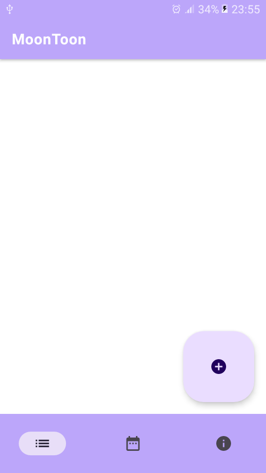
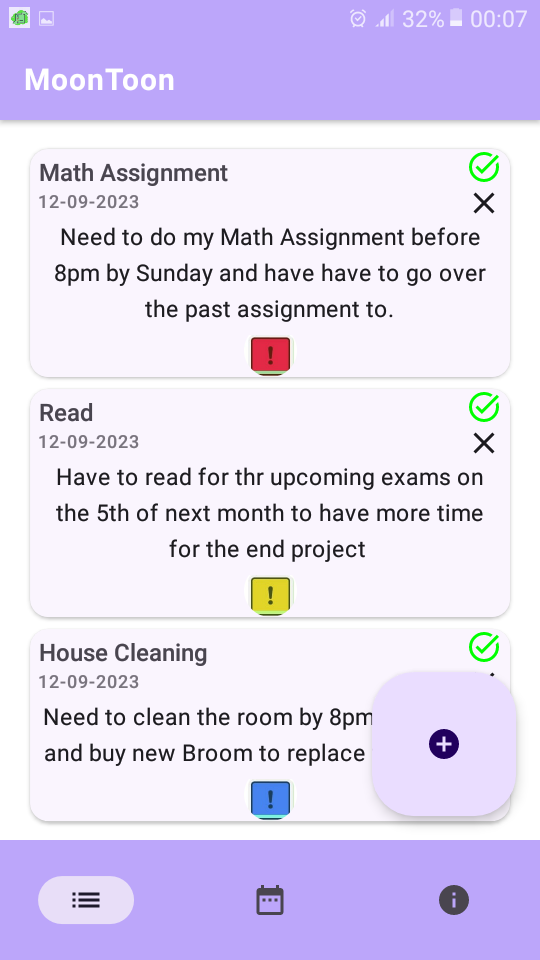
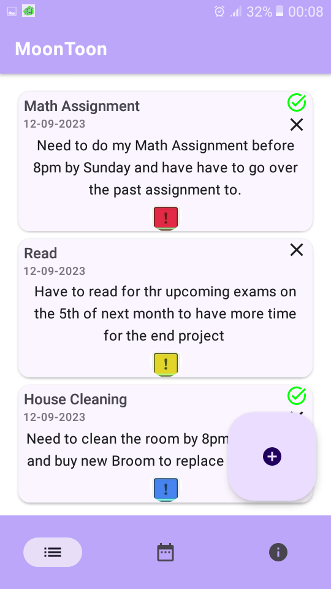
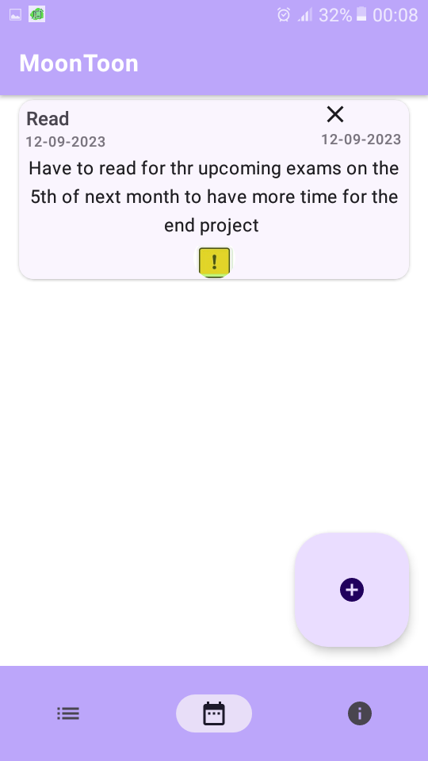
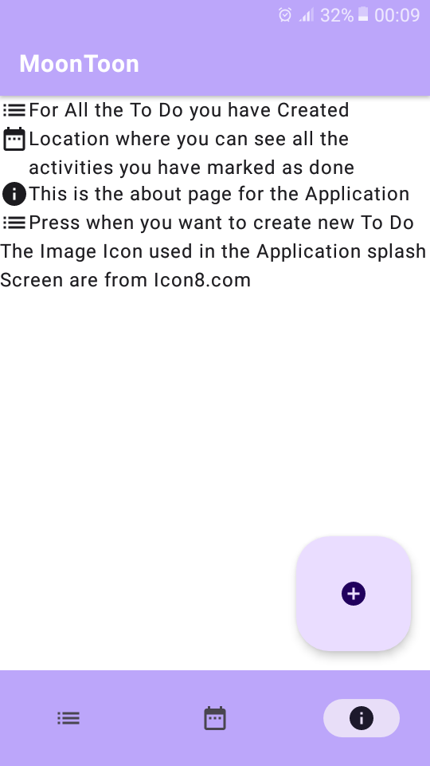
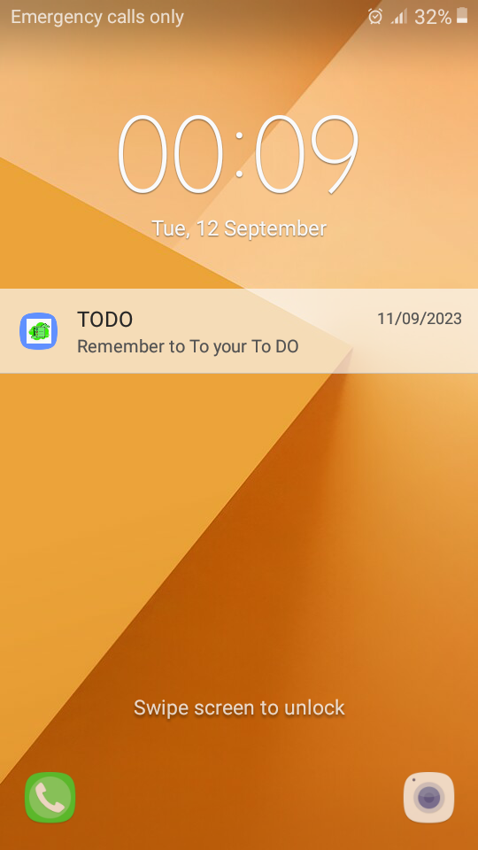

# MoonToon

MoonToon is an android application that show the use of MVVM architecture model in building Modern Android application.
It also Show the use of Dagger2 and Hilt to implement dependency Injection pattern on common libraries like Room and Workmanager.

### This application displays my Skills in the implementation of:
- Android clean architecture (MVVM)
- Know in the use **Room Library** (Implementation of CRUD)
- Know in the implementation of dependency Injection using **Dagger2 and Hilt**
- Know in the implementation of **WorkManager** for background tasks
- Know in Building of **Notification** and it's execution and management with **WorkManager**
- Know in the latest Navigation library and implementation in Jetpack Compose
- Know on **Permissions request** and **Permission Flow**.
- Use of **GIT** and **GITHUB** in development Cycle
- Finally the use of **Jetpack compose** to implement the UI


## Table of Contents

- [Introduction](#introduction)
- [Features](#features)
- [Screenshots](#screenshots)
- [Installation](#installation)
- [Usage](#usage)
- [Contributing](#contributing)
- [License](#license)
- [Acknowledgments](#acknowledgments)

## Introduction
Welcome to MoonToon, your simple and effective task management app that empowers you to stay organized and productive,no matter how busy your schedule.
MoonToon app helps you keep track of all your activities,giving you the power to **Create**,**Read**,**Update**,**Delete** and keep up with your activities.

## Features

### Key Features of MoonToon:

- **Task Management:** Create, edit, and organize your tasks with ease.

- **Intuitive Interface:** MoonToon boasts a clean and intuitive user interface, making it a breeze to add, update, or complete tasks.

- **Reminders and Due Dates:** Never miss an important deadline again as the MoonToon sends notification to remind you of upcoming activities

- **Priority System:** Mark tasks as high, medium, or low priority to focus on what matters most.

- **Notes and Attachments:** Add detailed notes to your tasks for better context and reference.

- **Dark Mode:** Enjoy MoonToon in a comfortable dark mode, reducing eye strain during late-night planning sessions.


## Screenshots

Include screenshots or images that showcase your app's user interface or functionality. You can embed images like this:








## Installation

 Instructions on how to install your app. Include prerequisites, dependencies, and any specific steps needed for installation.
 
`Dependencies
 `

    def room_version = "2.5.2"
    implementation "androidx.room:room-ktx:$room_version"

    implementation "androidx.room:room-runtime:$room_version"
    annotationProcessor "androidx.room:room-compiler:$room_version"

    // To use Kotlin Symbol Processing (KSP)
    ksp "androidx.room:room-compiler:$room_version"


    // optional - RxJava2 support for Room
    implementation "androidx.room:room-rxjava2:$room_version"

    // optional - RxJava3 support for Room
    implementation "androidx.room:room-rxjava3:$room_version"

    // optional - Guava support for Room, including Optional and ListenableFuture
    implementation "androidx.room:room-guava:$room_version"

    //Hilt
     implementation("com.google.dagger:hilt-android:2.47")
    implementation 'androidx.hilt:hilt-work:1.0.0'
     kapt("com.google.dagger:hilt-android-compiler:2.44")

      //Notification
    def core_version = "1.10.1"
    implementation "androidx.core:core-ktx:$core_version"

    //Permissions
    implementation "com.google.accompanist:accompanist-permissions:0.21.1-beta"

    //Material3
    implementation "androidx.compose.material3:material3:1.1.1"
    implementation "androidx.compose.material3:material3-window-size-class:1.1.1"

    //Navigation
    def nav_version = "2.7.1"

    implementation "androidx.navigation:navigation-compose:$nav_version"

    implementation 'androidx.hilt:hilt-navigation-compose:1.0.0'

    //Pemissions
    def activity_version = "1.7.2"
    def fragment_version = "1.6.1"
    implementation("androidx.activity:activity-ktx:$activity_version")
    implementation "androidx.fragment:fragment-ktx:$fragment_version"
    
    //Workmanager
    def work_version = "2.8.1"
### For Hilt Implementation for Room
 ```Kotlin
         @Module
        @InstallIn(SingletonComponent::class)
        object AppModule {

    @Singleton
    @Provides
    fun provideItemRepository(itemDao: Items_Data_BaseDao): ItemRespository{
        return ItemRespository(itemDao)
    }

    @Singleton
    @Provides
    fun provideItemDao(appDatabase:Items_Database): Items_Data_BaseDao{
        return  appDatabase.itemDao()
    }

    @Provides
    @Singleton
    fun provideAppDatabase(@ApplicationContext context: Context): Items_Database {
        return Room.databaseBuilder(
            context.applicationContext,
            Items_Database::class.java,
            "word_database"
        ).build()
    }

      }
```
    
## Usage

The app Makes use of Navigation to transition throug the application Go to the about page of the app for full details.


## License

```
Copyright 2022 The Android Open Source Project

Licensed under the Apache License, Version 2.0 (the "License");
you may not use this file except in compliance with the License.
You may obtain a copy of the License at

    https://www.apache.org/licenses/LICENSE-2.0

Unless required by applicable law or agreed to in writing, software
distributed under the License is distributed on an "AS IS" BASIS,
WITHOUT WARRANTIES OR CONDITIONS OF ANY KIND, either express or implied.
See the License for the specific language governing permissions and
limitations under the License.

```

## Acknowledgments
  ### Icon8.com
  ### Android Docs
  ### [vsten](https://vtsen.hashnode.dev/)https://vtsen.hashnode.dev/
  ### Stevdza-San @Youtube
  ### Philipp Lackner @ youtube
  

